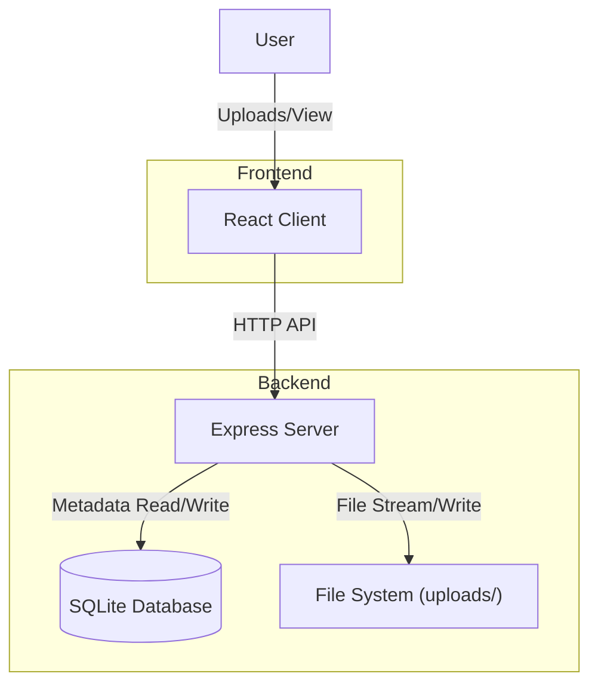

# Mini Document Manager

A minimal full-stack document manager application built with Node.js, Express, SQLite, React, and TailwindCSS.

## Features

- **Upload**: Upload multiple documents at once.
- **List**: View uploaded documents with pagination, sorting, and search.
- **Download**: Stream files from the server to the client.
- **Architecture**: Clear separation of concerns (Metadata in SQLite, Files on Disk).

## Setup & Running

### Prerequisites
- Node.js (v14+ recommended)
- npm

### Installation

1.  **Backend Setup**
    ```bash
    cd server
    npm install
    # Starts server on http://localhost:3000
    npm start 
    ```

2.  **Frontend Setup**
    ```bash
    cd client
    npm install
    # Starts vite dev server on http://localhost:5173
    npm run dev
    ```

## Architecture Diagram



## Design Questions

### 1. Multiple Uploads
**How does your system handle uploading multiple documents?**
- **One request or many?** The system uses a single HTTP POST request with `multipart/form-data`. The `files` field accepts an array of files.
- **Any limits or tradeoffs?** 
    - **Limits:** Currently limited by the server's configured maximum request body size (default in Express/Multer).
    - **Tradeoffs:** Uploading very large numbers of files in a single request could timeout or consume excessive memory/disk I/O simultaneously. A production system might implement chunked uploads or upload individual files in parallel for better reliability and progress tracking.

### 2. Streaming
**Why is streaming important for upload/download?**
- **Memory Efficiency:** Streaming allows processing files chunk by chunk without loading the entire file into RAM. This is critical for large files (e.g., video, large datasets) to prevent server crashes due to Out-Of-Memory (OOM) errors.
- **Response Time:** For downloads, the client can start receiving data immediately rather than waiting for the server to read the whole file first.

**What problems occur if the server loads the full file into memory?**
- High memory consumption per request.
- Reduced concurrency (server can handle fewer simultaneous users).
- node.js process could crash if the file size exceeds the heap limit.

### 3. Moving to S3
**If files move to object storage (e.g., S3):**
**What changes in your backend?**
- **Storage Logic:** Replace `fs` and `multer.diskStorage` with an S3 client (e.g., `aws-sdk`) and `multer-s3`.
- **Download Logic:** instead of reading from disk (`fs.createReadStream`), the backend would either:
    - Generate a **Presigned URL** and redirect the client to download directly from S3 (offloading bandwidth).
    - Stream from S3 through the backend to the client (if strict access control is needed).
**Would the backend still handle file bytes?**
- Ideally **No**. Using Presigned URLs for uploads and downloads is the most scalable approach, where the client communicates directly with S3. The backend only handles metadata and authorization.

### 4. Frontend UX
**If you had more time:**
- **Document Preview:** Implement file-type specific viewers (PDF.js for PDFs, `` for images) in a modal.
- **Upload Progress:** Use `XMLHttpRequest` or Axios with `onUploadProgress` to show a real-time progress bar for each file.
- **Drag & Drop:** Implement a drag-and-drop zone using `react-dropzone` for better usability.

## Key Tradeoffs (Time Limit)

- **No Authentication:** The system assumes a trusted local environment or private network.
- **SQLite:** Used for simplicity and being file-based (zero config), but lacks the concurrency features of PostgreSQL/MySQL.
- **Local Filesystem:** Files are stored locally, which doesn't scale across multiple server instances (requires a shared volume or S3).
- **Validation:** Basic validation checks (file presence), but lacks deep security scans (antivirus, extensive mime-type verification).
