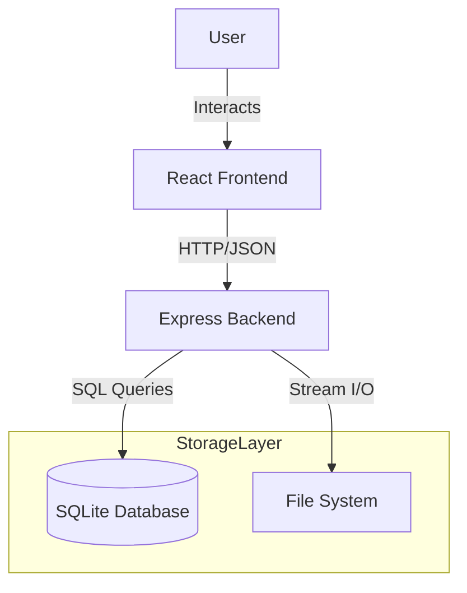
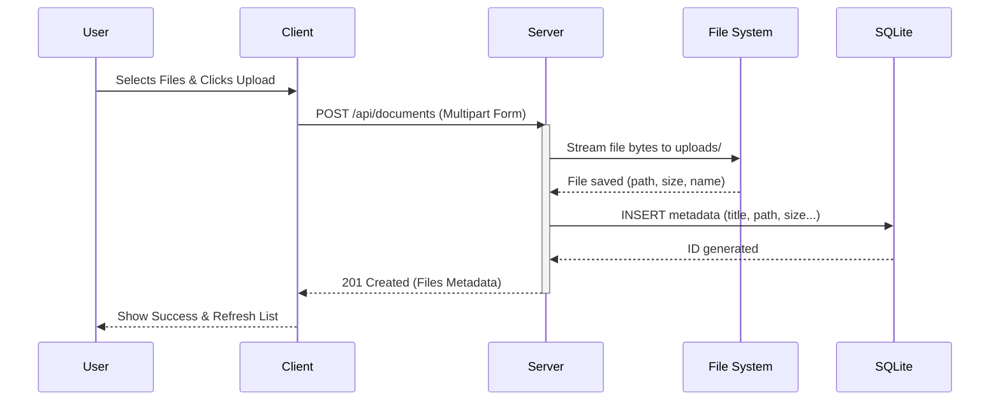
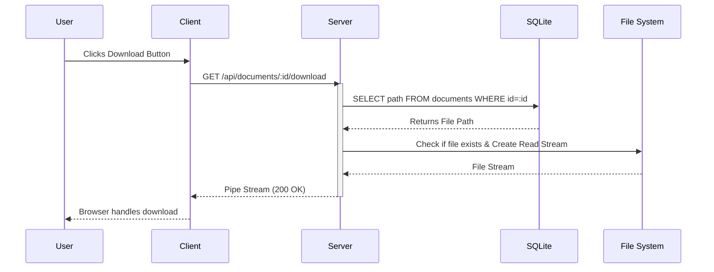

# Architecture & Flows

## 1. System Architecture

```mermaid
graph TD
    User[User] -->|Interacts| Client[React Frontend]
    Client -->|HTTP/JSON| Server[Express Backend]
    Server -->|SQL Queries| DB[(SQLite Database)]
    Server -->|Stream I/O| FS[File System]
    
    subgraph StorageLayer
    DB
    FS
    end
```

## 2. Upload Flow (Sequence)

```mermaid
sequenceDiagram
    participant User
    participant Client
    participant Server
    participant FS as File System
    participant DB as SQLite

    User->>Client: Selects Files & Clicks Upload
    Client->>Server: POST /api/documents (Multipart Form)
    activate Server
    Server->>FS: Stream file bytes to uploads/
    FS-->>Server: File saved (path, size, name)
    Server->>DB: INSERT metadata (title, path, size...)
    DB-->>Server: ID generated
    Server-->>Client: 201 Created (Files Metadata)
    deactivate Server
    Client-->>User: Show Success & Refresh List
```

## 3. Download Flow (Sequence)

```mermaid
sequenceDiagram
    participant User
    participant Client
    participant Server
    participant DB as SQLite
    participant FS as File System

    User->>Client: Clicks Download Button
    Client->>Server: GET /api/documents/:id/download
    activate Server
    Server->>DB: SELECT path FROM documents WHERE id=:id
    DB-->>Server: Returns File Path
    Server->>FS: Check if file exists & Create Read Stream
    FS-->>Server: File Stream
    Server-->>Client: Pipe Stream (200 OK)
    deactivate Server
    Client-->>User: Browser handles download
```
