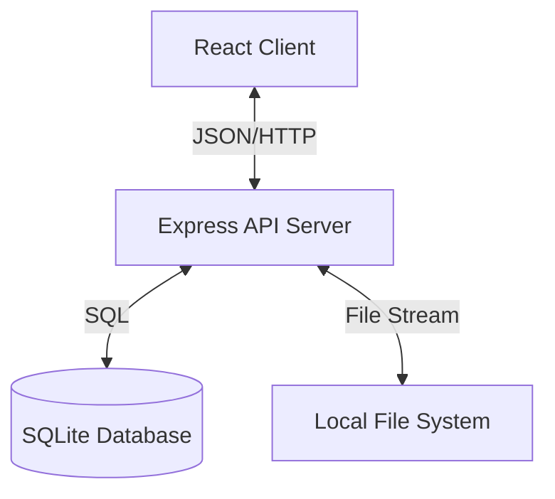

# High Level Design (HLD)

## 1. System Overview
The **Mini Document Manager** is a full-stack web application designed to handle the upload, storage, retrieval, and download of documents. It prioritizes a clean separation of concerns between metadata management (structured data) and binary file storage (blob data).

## 2. Architecture
The system follows a typical **Client-Server** architecture pattern.

### 2.1 Component Diagram

### 2.2 Data Flow
1.  **Upload Flow**:
    *   Client sends `POST /api/documents` with `multipart/form-data`.
    *   Server receives the stream.
    *   **Multer** middleware streams the binary data directly to the `uploads/` directory on disk.
    *   Upon successful write, Server extracts file info (name, size, path).
    *   Server inserts a new record into **SQLite** `documents` table.
    *   Server responds with the confirmed metadata.

2.  **Download Flow**:
    *   Client requests `GET /api/documents/:id/download`.
    *   Server queries DB for the file path using the ID.
    *   Server verifies file existence on disk.
    *   Server opens a **ReadStream** from the file system.
    *   Server pipes the stream to the HTTP Response object (efficient memory usage).

## 3. Technology Stack
*   **Frontend**: React, Vite, TailwindCSS (Responsive UI, SPA).
*   **Backend**: Node.js, Express (REST API).
*   **Database**: SQLite (Zero-configuration relational database).
*   **Storage**: Local Disk (Simulating minimal object storage).

## 4. Key Design Decisions
*   **Streaming**: Used for both uploads and downloads to ensure the application allows scaling to large files without exhausting server RAM.
*   **Metadata Separation**: Storing metadata in SQLite allows for rich querying (search, sort, filter) independent of the physical file storage.
*   **Single-Table Schema**: Given the scope, a single `documents` table is sufficient and performant.
